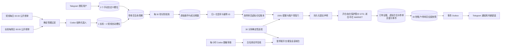

# Binance 公共带单员 Testnet 跟单子系统

## 当前运行边界

- 数据源：Binance 网页使用的公开合约跟单 BAPI，只读取公开带单员榜单与操作历史。
- 执行端：当前只启用 Binance USD-M Futures Testnet。正式盘执行入口已经预留，但必须同时通过独立数据库、独立凭据、短时效激活文件、API Key 指纹、生产端点和零暴露门禁；本机尚无正式盘凭据，因此保持锁定。
- 账户模式：Hedge Mode。每个带单员由独立虚拟仓位账本归属，交易所只保存同币种、同方向的聚合仓位。
- 资金边界：逻辑操作额度 150 USDT，其中 120 USDT 可用于开仓，30 USDT 保留；每单保证金最多 10 USDT，同币种累计最多 20 USDT。线路权重不再形成闲置资金硬隔离，带单员个人倍数只影响其未来目标名义金额；杠杆取交易所最新阶梯允许的最大值，仍不足时才按剩余保证金缩量。
- 未公开持仓：不推断。首次纳入时只建立操作历史基线，不回放旧订单；此后只根据新增、可明确解释的 LONG/SHORT 成交增量行动。
- `positionSide=BOTH`：只归档，不生成交易信号。
- 访问受限：记录 `ACCESS_DENIED` 并暂停新开仓；不绕过验证码、WAF 或伪造浏览器指纹。

## 数据与控制流

## 信号解释

- `LONG + BUY`、`SHORT + SELL`：增加对应带单员的虚拟仓位。
- `LONG + SELL`、`SHORT + BUY`：按该带单员当前虚拟仓位比例减仓，最多减到其自有虚拟数量。
- 开仓和加仓使用带单员公开成交均价作为保护限价。当前盘口更优时该限价单会立即跨价成交，
  但不会成交在比带单员均价更差的价格；当前盘口更差时订单留在盘口等待，不追价。
- 短线保护限价使用交易所原生 `GTD` 一小时有效期，长线为 24 小时。VPS 同时进行主动
  到期对账，避免交易所撤单事件遗漏。
- 同一带单员、币种和持仓方向出现减仓时，先撤销仍可能成交的开仓/加仓单。终态部分成交
  先按实际成交量归属，再计算减仓；无法确认撤单结果时暂停该减仓信号并按原订单号重查。
- 减仓和平仓使用市价单立即同步风险敞口，不因等待更优价格继续持有带单员已经退出的仓位。
- 本地没有归属仓位的减仓/平仓：记为 `IGNORED_ORPHAN`，不会错误影响其他带单员。
- 自动槽位轮换先检查旧带单员的虚拟仓位和未决入场单：没有敞口就立即替换；有敞口时长线最多等待 1 天、短线最多等待 2 小时。期限内清仓后才替换，超时仍有敞口则取消本轮替换，绝不为换人强平。
- 短线 1 固定使用公开胜率最高方案（同胜率再比较本系统可验证的平仓表现、回撤和活跃度）；短线 2 由 Codex 综合 1/3/7 日活跃、活跃天数、胜率、平仓结果、回撤、币种兼容率和操作新鲜度选择当日最优。两个短线槽位禁止互换已有带单员，避免槽位归属混乱。一个仓位从开仓、加仓到平仓始终归属开仓时的槽位。
- 自定义 1、自定义 2 完全由 Telegram 授权用户输入公开带单员 ID 或名称设置；每日短线和每周长线自动选人都不会候选、替换或清空这两个槽位。自定义槽位仍使用独立虚拟账本、相同的 30 秒轮询、共享资金上限、倍数配置、成交和盈亏通知。
- 已持久化的错误槽位归属不修改原始盈亏事件，而是追加带原因和操作者的纠正事件；估值、仓位展示和后续成交统一读取纠正后的有效槽位。
- 长线/短线权重只描述选人和归属优先级，不是保证金硬分区；所有带单员共享 120U 开仓池，
  同时受每单 10U、同币种 20U 和 30U 备用金约束。`DRAINING` 带单员不再增加风险。
- Testnet 压测阶段，日内综合候选必须达到 1/3/7 天至少 1/5/14 次操作、7 天至少 3 个活跃日；短线 1 先验证样本规模、回撤、盈亏比和盈利集中度，再从稳健候选中选择可信胜率最高者；短线 2 在相同风控基础上综合近期盈亏与活跃度，操作次数不再拥有最高优先级。
- 交易所同一币种同一方向的数量必须等于所有带单员虚拟数量之和；不一致时巡检暂停新开仓并通知。

## 盈亏口径

- 系统总盈亏以专用 Binance USD-M Testnet 账户相对首次系统基线的余额变化为准；累计值包含
  手续费、资金费与未实现盈亏。每 30 秒保存一次不可修改的账户估值，可按上海自然日和自然月
  计算“今日/本月/累计”。
- 各带单员盈亏只使用本系统真实成交回报、该带单员独立虚拟仓位的加权开仓均价，以及交易所
  当前标记价计算。该值是归属毛盈亏，不重复猜测 Binance 网页未公开仓位，也不把网页展示的
  带单员收益当作本系统收益。
- 每笔实际成交同时绑定当时的固定槽位。长线、短线 1、短线 2、自定义 1、自定义 2 的
  今日/月度/累计毛盈亏都按线路连续保存；换人不会清零该线历史表现，个人盈亏明细仍按
  带单员独立保留。
- 手续费和资金费只在系统总盈亏中权威体现，不强行按带单员拆分；因此各带单员毛盈亏之和与
  系统净盈亏允许存在合理差额。
- 用户要求重置盈亏口径时，系统追加一个不可修改的统计基线事件，不删除历史成交、估值或审计记录。
  重置时当前净值从 150 U 重新计算，之后按“150 U + 基线后新盈亏”变化；未平仓位会随行情立即产生新浮动盈亏。

## 幂等与异常状态

每个公开成交增量、信号、提交声明和交易所 `newClientOrderId` 都由稳定摘要派生。提交声明
必须先写数据库再调用交易所，并持久化订单类型、保护价格和到期时间。网络结果不确定时只按
同一个客户端订单 ID 查询，不盲目重下。尚未成交的保护限价也计入 150U 额度占用，避免多个
加仓挂单并发成交后突破资金边界。

账户预警线只暂停新开仓，带单员减仓和平仓继续允许；紧急线进入 `REDUCE_ALL`。安全原因触发的全部减仓在虚拟仓位、交易所仓位、系统挂单和未决恢复信号全部归零后仍回到 `PAUSED_NEW_ENTRIES`；只有授权 Telegram 用户主动发起的人工清仓才在同样的四重确认后自动恢复。

资金分配不再把长线/短线槽位权重当作不可借用的保证金硬分区。每笔新单保证金上限为 10 USDT，同币种累计保证金上限为 20 USDT，账户保留 30 USDT 备用金；目标名义金额优先匹配带单员，杠杆固定选择最新 `leverageBracket` 对当前币种允许的最高初始杠杆（协议边界 125 倍）。杠杆不改变按成交名义金额收取的交易手续费；入场继续使用可立即成交的保护限价，避免为追求 maker 费率而扩大跟单时差。

## 自动任务

| 任务 | 周期 | 作用 |
| --- | --- | --- |
| `aiq-copy-poller.service` | 30 秒循环 | 分带单员采集、归一化、Testnet 下单、账户/带单员估值与通知 |
| `aiq-copy-leader-selector.timer` | 上海时间每日 00:00 | 短线 1 最高胜率；短线 2 当日日内综合最优 |
| `aiq-copy-long-leader-selector.timer` | 上海时间每周日 00:00 | 综合收益、回撤、稳定性、历史长度与可跟随性选择长线 |
| `aiq-copy-watchdog.timer` | 每 30 分钟 | 确定性检查数据库、轮询、风险、死信和仓位对账 |
| `aiq-copy-codex-audit.timer` | 每小时 | 用脱敏摘要做结构化审查，仅执行本地白名单动作 |
| `aiq-copy-telegram.service` | 持续长轮询 | 状态面板、通知、槽位增删改以及二次确认控制 |

Telegram 的底部键盘只保留六个高频入口，其中“盈亏”展示系统今日、本月和累计净盈亏，
同时展示长线、短线 1、短线 2、自定义 1、自定义 2 跨换人的归属盈亏，下方再按槽位和“排空仓位”
的顺序提供各带单员明细按钮。所有出现带单员 ID 的 Telegram 仓位、订单、通知、确认和结果
消息都同时显示最新公开名称。进入“带单员”后，通过独立内嵌管理面板选择
长线/短线槽位、查看带有近期操作证据的候选，或直接为“自定义 1/2”输入任意可验证的公开带单员 ID/名称并替换、删除。自定义槽位不受自动选人的胜率、活跃度和 Testnet 币种兼容筛选门槛约束，但实际出现 Testnet 不支持的币种时仍按执行规则安全跳过。所有写操作均须由授权用户
二次确认，确认令牌两分钟失效且只能消费一次。新增带单员先建基线，不回放历史订单。
管理面板另提供“配置跟单倍数”：范围 1–10 倍，配置绑定带单员 ID 而非槽位。自动或手动换人后，
旧人的倍数不会传给新带单员，新人无历史配置时为 1 倍。倍数只参与后续新信号的本地比例目标计算；
已有仓位和已持久化的待入场订单保持原数量，减仓继续按各带单员自己的虚拟仓位比例执行。
每个槽位的候选页把推荐点选和“输入 ID 或名称”合并为一个入口：用户回复任意公开带单员 ID 时，服务会遍历当前
Binance 公开目录定位唯一资料并刷新最近 50 条操作；回复名称时按名称搜索并返回唯一 ID
按钮。也可直接使用 `/leader_set short1 <ID>` 或 `/leader_find short1 <名称>`。未找到、
Testnet 币种兼容率不足、短线活跃度不足或方向字段有歧义时，不建立变更确认。

## 上正式盘前

正式盘保持锁定。代码已提供严格分离的生产客户端、`PRODUCTION` 运行模式、生产巡检/审查模式、
独立的 55433 PostgreSQL 数据卷以及 `deploy/systemd/production/` 候选单元。切换不是修改 Testnet URL：

1. 停止测试盘 poller、Telegram、选人和巡检，确认测试盘未决提交已经终态；测试盘数据库只归档，不复制到生产盘。
2. 将专用正式盘 API Key、Secret、数据库密码及根据 `config/copy-production-activation.example.json`
   生成的短时效激活文件放入仓库外 root-only 目录。激活文件必须绑定 API Key 的 SHA-256、
   `https://fapi.binance.com`、150U 边界、Hedge Mode 确认和“不复用测试库”确认。
3. 安装生产候选 systemd 单元并启动独立生产数据库；运行完整迁移。首次绑定前数据库必须没有任何
   测试/交易事实，正式盘账户必须 `canTrade=true`、Hedge Mode、零持仓、零挂单。
4. 先启动 poller 做公开历史基线和只读对账。新生产数据库没有 `RUNNING` 控制事件时默认暂停开仓；
   只有上述门禁、Watchdog、备份恢复验证和人工核验完成后，才由授权 Telegram 操作恢复。
5. 正式盘每个客户端订单号使用独立 `aqc-p` 命名空间，测试盘使用 `aqc-t`，数据库绑定一旦写入便
   不允许换环境。任何激活过期、Key 指纹变化、数据库复用或巡检环境错配都会失败关闭。

当前只完成了代码、配置和故障注入验证；没有正式盘密钥，所以没有进行真实生产下单验证，也不会
把“已预留切换路径”描述成“已实盘通过”。
